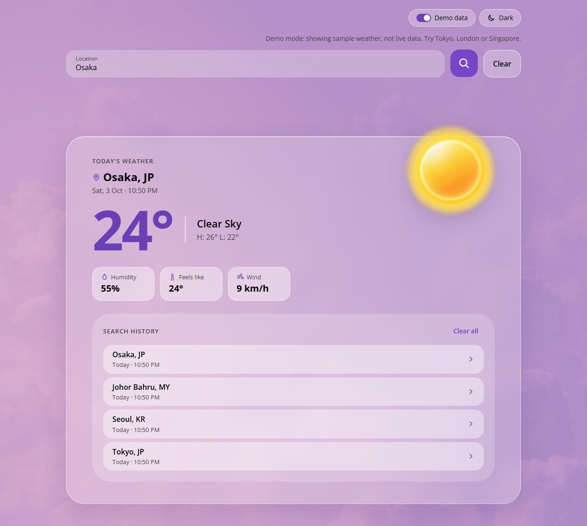
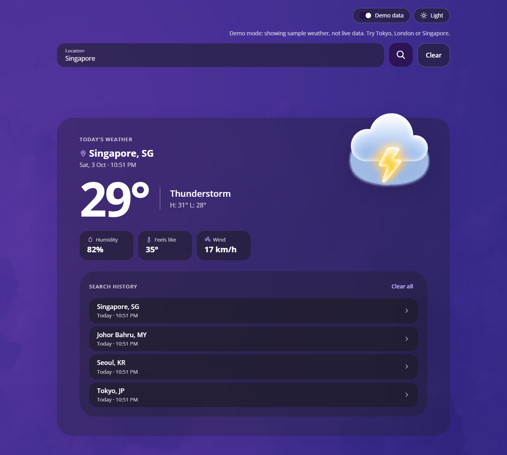
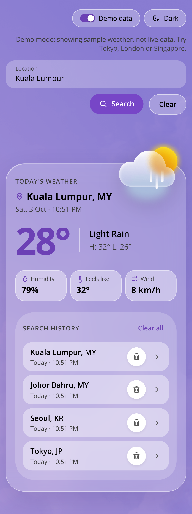
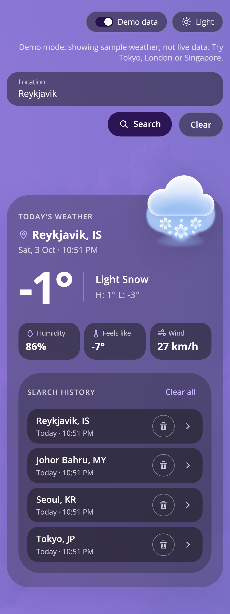
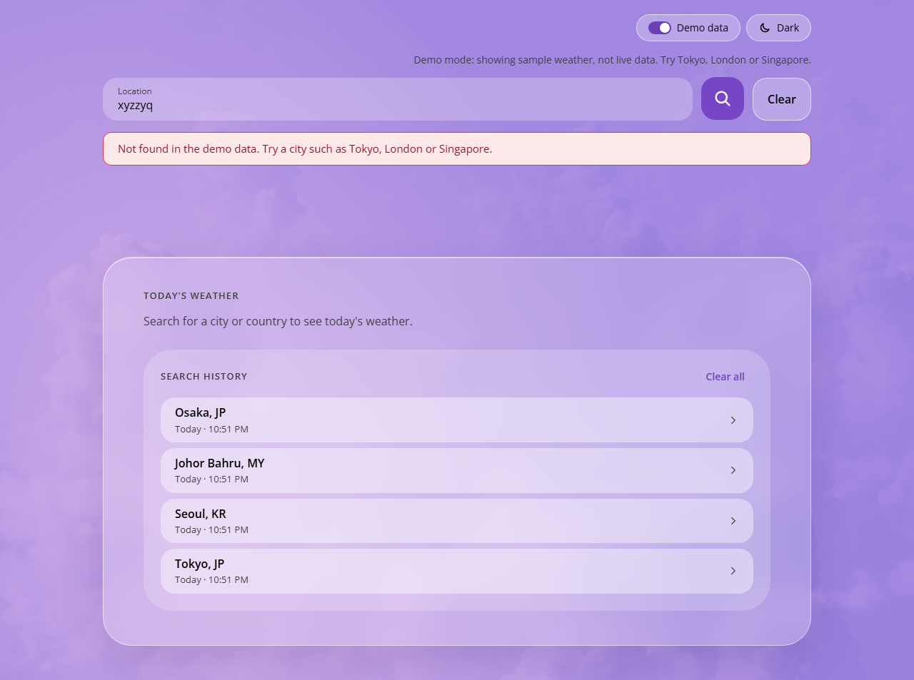
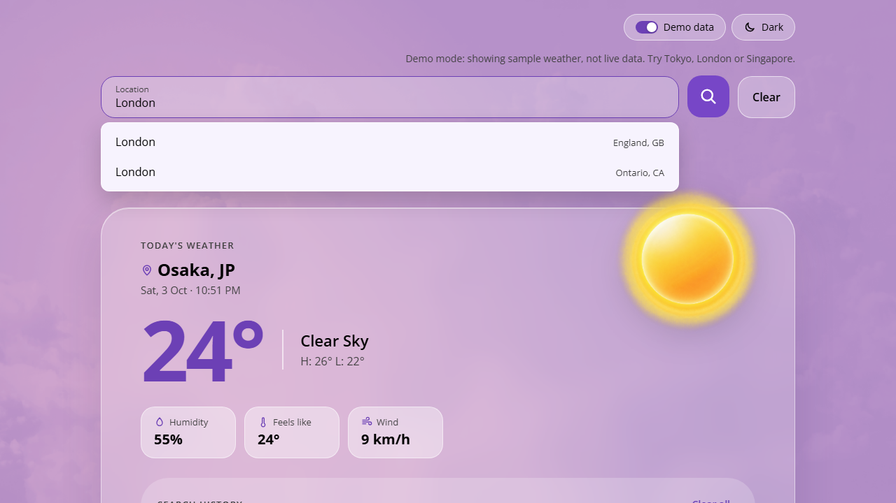

# Today's Weather

A responsive React + TypeScript app that shows today's weather for a city and/or
country, using OpenWeather's Geocoding and Current Weather APIs. It has city
suggestions while typing, a search history that survives refreshes, light/dark
themes, and an illustration and background tint for each kind of weather.

| Desktop — light                                            | Desktop — dark                                           |
| ---------------------------------------------------------- | -------------------------------------------------------- |
|  |  |

| Mobile — light                                           | Mobile — dark                                          | Invalid search                                   |
| -------------------------------------------------------- | ------------------------------------------------------ | ------------------------------------------------ |
|  |  |  |

| City suggestions                                                   |
| ------------------------------------------------------------------ |
|  |

## Quick start

Requires Node.js 20.19+ (or 22.12+).

```bash
npm install
cp .env.example .env   # then set VITE_OPENWEATHER_API_KEY=<your key>
npm run dev            # → http://localhost:5173
```

Get a free key at <https://home.openweathermap.org/api_keys> (new keys can take ~2
hours to activate). **No key?** The **Demo data** switch (on by default without a key)
runs the whole app on built-in sample weather, e.g. Tokyo, London or Singapore.

Other scripts: `npm test` (Vitest), `npm run test:e2e` (Playwright, desktop + mobile;
run `npm run test:e2e:install` once first), `npm run lint`, `npm run build`, and
`npm run check` (lint → typecheck → test → build).

## Architecture

```
src/
├── api/          # OpenWeather client, demo data client, and the switch between them
├── components/   # SearchForm, WeatherSummary, SearchHistory, toggles, shared ui/
├── hooks/        # Search, history, suggestions, theme, data mode, localStorage state
├── utils/        # Search text parsing, countries, formatting, weather illustrations
├── App.tsx       # Wires hooks to components
└── index.css     # Theme tokens (CSS variables) and the sky background
assets/           # Background skies and weather illustrations
e2e/              # Playwright tests, with a fake OpenWeather API
```

- **State lives in hooks, UI in components.** Components get data and callbacks
  through props, so each can be tested on its own; `App` only connects them.
- **The API layer returns app-shaped data** (`WeatherReport`), so nothing else
  depends on OpenWeather's response format. Live and demo data share one interface.
- **Places come from the Geocoding API**, then the weather is fetched by
  coordinates. OpenWeather has deprecated looking up weather by city name, and its
  older name list disagrees with the Geocoding one, so this keeps every suggestion
  searchable and same-named places (two Springfields) apart.
- **Styling** uses CSS Modules plus CSS variables; light and dark themes are two sets
  of tokens. OpenWeather's icon code (e.g. `10d`) picks the illustration and a
  `data-sky` tint on `<html>`.
- **Tested** with 218 Vitest + React Testing Library tests (100% line coverage, only
  `fetch` mocked) and 8 Playwright journeys. No test needs an API key or network.

## Assumptions

1. **One search box takes a city, a country, or both:** `Osaka`, `Osaka, Japan` /
   `Osaka, JP`, or `Japan`. A country on its own shows its capital's weather, since
   OpenWeather can't name a single point for a whole country.
2. **A typed search uses the best match**, the same place shown first in the
   suggestions. Unknown countries are caught before calling the API.
3. **Units are metric (°C)**, rounded to whole degrees.
4. **Times are the user's local search time**, shown as `Sat, 3 Oct · 10:50 PM`
   rather than the mockup's `03-10-2026`, which is ambiguous between countries.
   History shows recent times as "5 min ago".
5. **History** is newest first, de-duplicated by place, capped at 20 entries, and
   saved in `localStorage`. Failed searches aren't added. "Search again" reuses the
   saved coordinates and fills the search box.
6. **Clear** empties the search box and any error, but keeps the last result.
7. **The last result isn't restored after a refresh**, so old weather is never shown
   as current. Only history, theme and data mode are saved.
8. **A new search cancels the previous request**, so a slow response can't overwrite
   a newer one.
9. **The mockup is extended, not changed:** its sun/cloud artwork became one
   illustration per weather type (with night versions), and feels like and wind were
   added next to humidity.
10. **The API key is used in the browser** (`VITE_OPENWEATHER_API_KEY`). A
    production app should put it behind a backend proxy.
11. **Browser support:** current Chrome, Edge, Firefox and Safari, down to 320px wide.
